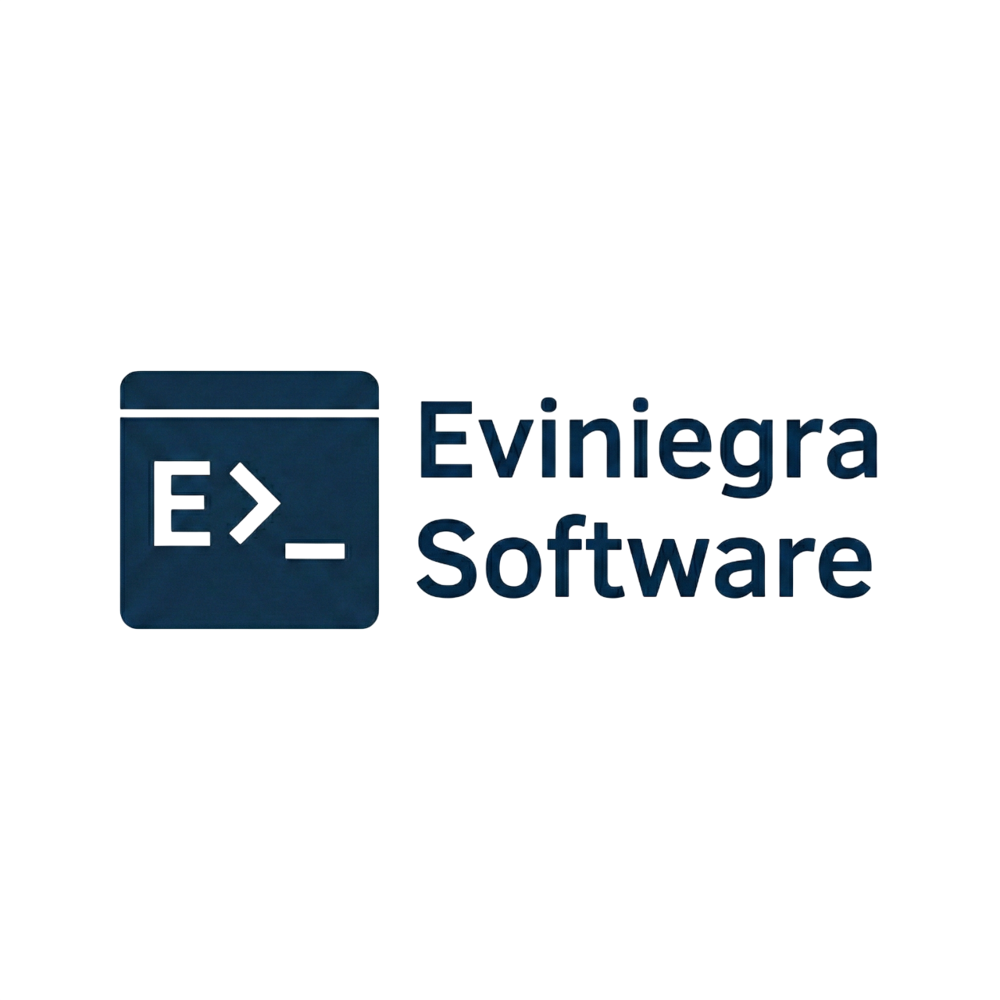
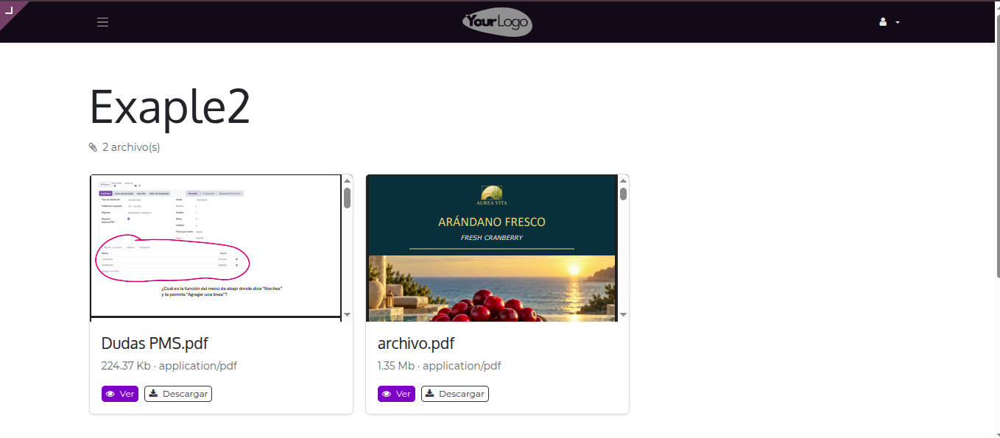
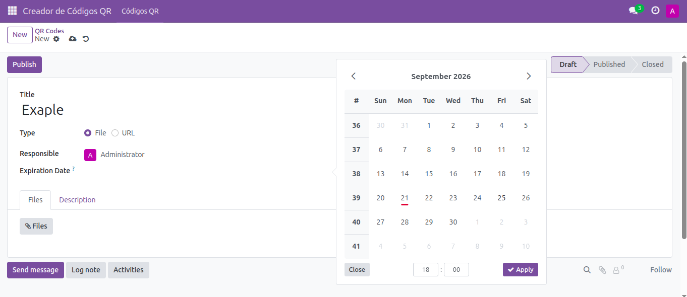
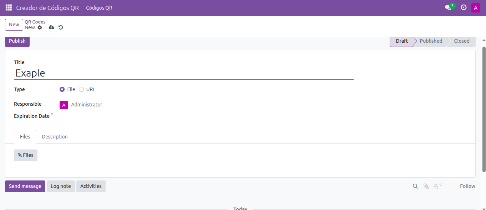
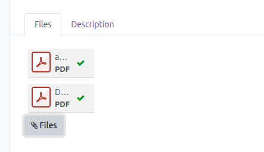
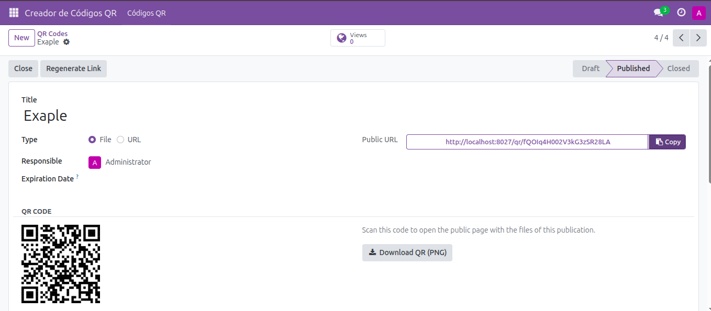

# QR File Publisher

**Generate and publish files or URLs via QR Codes directly from Odoo**

## Key Features

### 1. Smart File Publishing & Routing
Easily attach files to your QR Code records. 
- **Single File:** If you attach a single file, scanning the QR code will instantly redirect the user to the published file. 
- **Multiple Files:** If you attach multiple files, the link intelligently routes the user to a clean, public directory page where they can browse and select the file they want to view or download.

### 2. Expiration Dates
Need a temporary QR code? You can easily set an **Expiration Date**. Once the date passes, the QR code link will no longer be accessible. If you leave the expiration date empty, the QR code will be permanently active.

### 3. Publish Files or Redirect URLs
The module isn't just for files! You can change the "Type" to **URL** and use the QR code to simply redirect users to any external web page or Odoo portal page.

### 4. Domain & URL Configuration
The generated public URLs automatically use the same base domain configured in your Odoo instance. If you encounter issues with the link domain, simply review the `web.base.url` system parameter in Odoo's technical settings.

---

## How it works

### 1. Attach Files
Create a new QR Code record and add the files you want to share using the attachments tab.

### 2. Publish and Generate QR
Click "Publish". The module will generate a unique Public URL and a downloadable QR Code image instantly.

---

## Developed By

**Esteban Viniegra Pérez Olagaray**
- 📧 **Email:** [esteban@eviniegra.software](mailto:esteban@eviniegra.software)
- 🌐 **Website:** [https://eviniegra.software](https://eviniegra.software)
